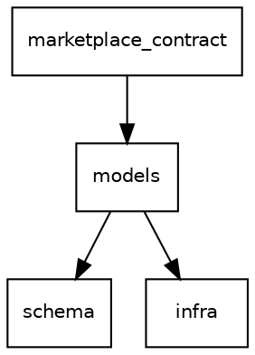

# Dependency graph export

## Context

`monorepo status` shows numeric dep/rdep counts in a table, but there's no way to see or export the actual graph structure. For large monorepos with layered architecture, understanding dependency flow is critical for architecture reviews, onboarding, and catching accidental coupling.

## Decisions

- **JSON default** output format (AI-first; LLMs parse JSON natively).
- **DOT and text tree** available via `--format=dot` and `--format=text`.
- **Web visualization schema**: purely future. Design JSON for current needs; don't over-engineer for a hypothetical web app.
- **Output to stdout** (pipeable). `--output <file>` for file output.

## Command

`monorepo graph [--format=json|dot|text] [--output <file>] [--root <package>] [--reverse <package>] [--depth N]`

### Formats

**JSON (default):**
```json
{
  "packages": {
    "models": {
      "deps": ["schema", "infra"],
      "rdeps": ["marketplace_contract", "flow_order"],
      "target": "dart",
      "version": "1.2.0"
    }
  },
  "edges": [
    {"from": "models", "to": "schema", "type": "versioned", "constraint": "^1.0.0"}
  ]
}
```

**DOT:**


Conventions: `dot` layout engine, `rankdir=TB`, `shape=box`, clusters for architectural layers (if layer rules are configured), edge styles for dep types (solid=versioned, dashed=explicit).

**Text tree:**
```
models
  schema
  infra
marketplace_contract
  models
    schema
    infra
```

### Filtering

- `--root <package>`: show only the subgraph reachable from this package (transitive deps).
- `--reverse <package>`: show only packages that depend on this package (transitive rdeps, i.e., "what breaks if this changes?").
- `--depth N`: limit traversal depth.

### Implementation notes

- Requires adding transitive traversal to `WorkspaceGraph` (currently only supports direct deps/rdeps). BFS/DFS over `dependencies()` / `dependents()`.
- DOT output should use clusters for layers if `[layers]` config exists in workspace.toml.
- For graphs with 40+ packages, `concentrate=true` in DOT reduces visual clutter. SVG output recommended (`dot -Tsvg`).

## Affected files

- `rlsbl/workspace_graph.py` -- add `transitive_deps(name)`, `transitive_rdeps(name)` methods
- `rlsbl/commands/monorepo.py` -- new `_cmd_graph` subcommand
- Possibly a new `rlsbl/graph_output.py` for format rendering (JSON, DOT, text)

## Effort

Medium. The graph traversal is straightforward. DOT rendering with clusters and styling is the main work.
